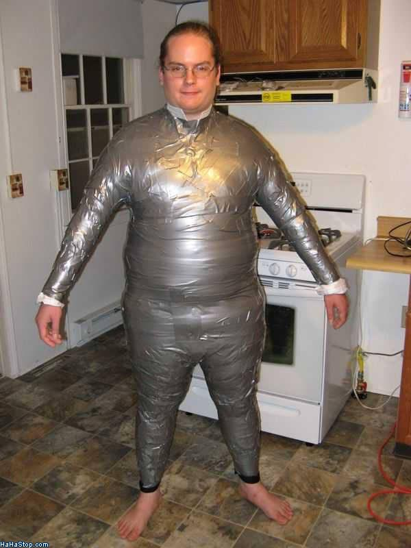

# Data-Driven Music in R
[Brian Abelson](http://brianabelson.com)


## Why would you want to make music in R?


### Reason 1: Your data is in R and you don't know any better


## Why would you _NOT_ want to make music in R?


### 


### 


### 


### 


### 


### Let's face it...


## The non-ducttape way...
- [Ari Russo's](http://www.github.com/arirusso) work with MIDI in Ruby.
- [SuperCollider](http://supercollider.sourceforge.net/)
- [Overtone](http://overtone.github.io/)


## Existing packages:
* [tuneR](http://cran.at.r-project.org/web/packages/tuneR/index.html)
    - sound i/o and manipulation
* [seewave](http://rug.mnhn.fr/seewave/)
    - graphical representations of sound
* [playitbyr](http://playitbyr.org/)
    - data sonification w/ ggplot2 syntax (kind of abstract)


## [ddr](http://github.com/abelsonlive/ddr) - data-driven rhythms in R
- built-in instrument and drum libraries (lists of wav files, easy to make your own!)
- mapping data to common scales and chords.
- simple sound manipulation (chop, reverse, pitch, loop, combine)


## _Remember..._
<center></center>
ddr is severely limited by its reliance on wav manipulation.


### Basics
<a target="_blank" href="examples/pianoC3.wav">
```
piano$C3
piano[["C3"]]
```
</a>
<a target="_blank" href="examples/pianoC3chopped.wav">
```
chop(piano$C3, bpm=100, count=1/8)
```
</a>
<a target="_blank" href="examples/pianoC3rev.wav">
```
reverse(piano$C3)
```
</a>
<a target="_blank" href="examples/pianoC3pitched.wav">
```
chop(pitch(piano$C3, -36, FALSE), bpm=100, count=2)
```
</a>
<a target="_blank" href="examples/pianoC3choppedlooped.wav">
```
loop(chop(piano$C3, bpm=100, count=1/8), 16)
```
</a>
<a target="_blank" href="examples/pianoC3chord.wav">
```
chord(C3, piano, "maj", bpm=100, count=4)
```
</a>


### Sound Sequencing - _Call Me Maybe_
<a target="_blank" href="examples/callmemaybe.wav">

```
c1 <- chord(A4, sweeplow, "maj", bpm=119, count=1)
c2 <- chord(E4, sweeplow, "maj", bpm=119, count=1)
c3 <- chord(B4, sweeplow, "maj", bpm=119, count=1)
c4 <- chord(C.4, sweeplow, "min", bpm=119, count=1)
wavs <- list(c1, c2, c3, c4, roland$HHC, roland$TAM, roland$HHO, roland$BD1, roland$SD1)

A <- c(1,0,0,0,0,0,0,0,0,0,0,0,0,0,0,0,0,1,1,0,0,0,0,0,0,0,0,0,0,0,0,0)
E <- c(0,0,0,0,0,0,0,1,0,0,0,0,0,0,0,0,0,0,0,0,0,0,0,1,0,0,0,0,0,0,0,0)
B <- c(0,0,0,0,0,0,0,0,0,1,1,0,0,0,0,0,0,0,0,0,0,0,0,0,0,1,1,0,0,0,0,0)
C.m<-c(0,0,0,0,0,0,0,0,0,0,0,0,0,0,0,1,0,0,0,0,0,0,0,0,0,0,0,0,0,0,0,0)
H <- c(0,1,0,1,0,1,0,1,0,1,0,1,0,1,0,1,0,1,0,1,0,1,0,1,0,1,0,1,0,1,1,1)
T <- c(0,0,1,0,0,0,1,0,0,0,1,0,0,0,1,0,0,0,1,0,0,0,1,0,0,0,1,0,0,0,0,0)
O <- c(0,0,0,0,0,0,0,0,0,0,0,0,0,0,0,0,0,0,0,0,0,0,0,0,0,0,0,0,0,1,0,1)
K <- c(1,0,1,0,1,0,1,0,1,0,1,0,1,0,1,0,1,0,1,0,1,0,1,0,1,0,1,0,1,0,1,0)
S <- c(0,0,1,0,0,0,1,0,0,0,1,0,0,0,1,0,0,0,1,0,0,0,1,0,0,0,1,0,0,0,1,0)
seqs <- list(A, E, B, C.m, H, T, O, K, S)

callmemaybe <- sequence(wavs, seqs, bpm=59.5, count=1/16)
play(loop(callmemaybe, 4))

```
</a>


### Randomly Generated Drums
<a target="_blank" href="examples/randomdrumloop.wav">
```
wavs <- list(roland$HHC, roland$TAM, roland$HHO, roland$BD1, roland$SD1)

H <- rnorm(32, mean=0.5, sd=0.15)
T <- rbinom(32, 1, prob=0.05)
O <- rbinom(32, 1, prob=0.075)
K <- rbinom(32, 1, prob=0.2)
S <- rbinom(32, 1, prob=0.3)
seqs <- list(H, T, O, K, S)

drum_loop <- sequence(wavs, seqs, bpm=59.5, count=1/16)
play(loop(drum_loop, 4))
```
</a>


### Data Sonification
Let's use ChickWeight - Iris is so played out...
<a target="_blank" href="examples/chicks.wav">
```
data('ChickWeight')
cw <- ChickWeight

chicks <- arpeggidata(sqrt(sw$weight),
                      blip,
                      scale="Emajor",
                      bpm=200,
                      count=1/32)
play(chicks)
```
</a>


### [FMS Symphony](http://fms.csvsoundsystem.com)
```
bpm <- 280
ct <- 1/4

rate <- arpeggidata(fms_data$rate,
            sinewave,
            low_note="",
            high_note="",
            descending = FALSE,
            scale="Cmajor",
            remove=NULL,
            bpm=bpm,
            count=ct)
writeWave(rate, "rate.wav")

ceil <- arpeggidata(fms_data$dist_to_ceiling,
            sinewave,
            low_note="",
            high_note="",
            descending = TRUE,
            scale="Emajor",
            remove=NULL,
            bpm=bpm,
            count=ct)
writeWave(ceil, "ceiling.wav")

gen_chords <- function(z) {
    if (z < 0) {
        if (z <= -0.5) {
            c <- chord(A3, sinewave,
                       "min", bpm=bpm,
                       count=ct)
        } else {
            c <- chord(A4, sinewave,
                       "min", bpm=bpm,
                       count=ct)
        }
    } else {
        if (z >= 0.5) {
            c <- chord(C4, sinewave,
                       "maj", bpm=bpm,
                       count=ct)
        } else {
            c <- chord(C3, sinewave,
                       "maj", bpm=bpm,
                       count=ct)
        }
    }
    return(c)
}

chords <- llply(fms_data$z_change, gen_chords, .progress="text")
bind_list_of_waves <- function(x, y) {
    bind(x, y)
}

reduce_waves <- function(list_of_waves) {
    Reduce(bind_list_of_waves, list_of_waves)
}
chords <- reduce_waves(chords)
writeWave(chords, "chords.wav")
```


### Download ddr
```
library("devtools")
install_github("ddr", "csv")
library("ddr")
```
Use a fast connection to download!!!


### Thanks
- Thomas Levine, data superhero, is available for hire.
<br></br>
- Our band, [CSV Soundsystem](http://www.csvsoundsystem.com/) is available to play your:
    * Shareholder meetings.
    * Christmas parties.
    * Sweaty warehouses.
